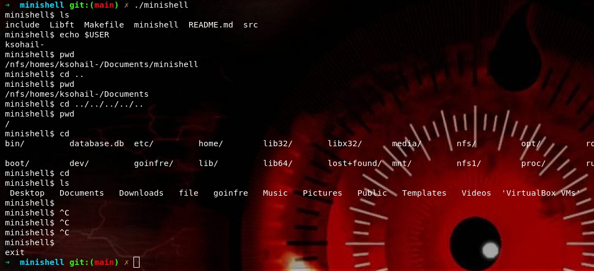

# Minishell



## Table of Contents

- [Introduction](#introduction)
- [Features](#features)
- [Built-ins](#built-ins)
- [Installation](#installation)
- [Usage](#usage)
- [Examples](#examples)
- [Project Structure](#project-structure)
- [Contact](#Contact)

## Introduction

`minishell` is a simple UNIX shell developed as part of the 42 School curriculum. It mimics the behavior of bash with a subset of its features, providing a command-line interface for interacting with the operating system.

## Features

- Display a prompt when waiting for a new command.
- Working command history.
- Search and launch the right executable based on the PATH variable or using a relative or an absolute path.
- Support for single and double quotes, preventing the shell from interpreting metacharacters within quotes.
- Redirections:
  - `<` for input redirection.
  - `>` for output redirection.
  - `<<` for heredoc.
  - `>>` for appending output redirection.
- Piping: Use `|` to connect the output of one command to the input of another.
- Environment variable handling, including:
  - `$?` for the last executed command's exit status.
  - `$_` for the last argument of the previous command executed.
- Signal handling for `ctrl-C`, `ctrl-D`, and `ctrl-\`.
  - `ctrl-C` displays a new prompt on a new line.
  - `ctrl-D` exits the shell.
  - `ctrl-\` does nothing.
- Implementation of the following built-in commands:
  - `echo` with `-n` option.
  - `cd` with relative or absolute paths.
  - `pwd` without options.
  - `export` without options.
  - `unset` without options.
  - `env` without options or arguments.
  - `exit` without options.

## Built-ins

- `echo [-n] [string ...]`: Prints the string to the standard output.
- `cd [path]`: Changes the current directory to the specified path.
- `pwd`: Prints the current working directory.
- `export [name[=value] ...]`: Sets environment variables.
- `unset [name ...]`: Unsets environment variables.
- `env`: Prints the environment variables.
- `exit`: Exits the shell.

## Installation

1. Clone the repository:
   ```sh
   git clone https://github.com/yourusername/minishell.git
   cd minishell
    ```

## Usage

1. Build the project:
    ```sh
    make
    make clean
    ```
2. run it:
    ```sh
    ./minishell
    ```
  - `ctrl-D` to exit.

## Examples

```sh
minishell$ echo "Hello, World!"
Hello, World!
minishell$ pwd
/home/yourusername/minishell
minishell$ export MYVAR="Hello"
minishell$ echo $MYVAR
Hello
minishell$ ls | grep minishell
minishell
minishell$ cat < input.txt > output.txt
minishell$ echo $_
output.txt
```

## Project Structure

```sh
minishell/
├── include/
│   ├── minishell.h
│   ├── banner.png
├── src/
│   ├── *.c
├── Libft/
│   ├── *.c
│   ├── *.h
├── Makefile
├── README.md
```

## Contact Information

- **Email:** [khalilsohail24@gmail.com](mailto:khalilsohail24@gmail.com)
- **Discord:** khalil_sohail
- **LinkedIn:** [LinkedIn Profile](https://www.linkedin.com/in/khalil-sohail-5260892b8/)
